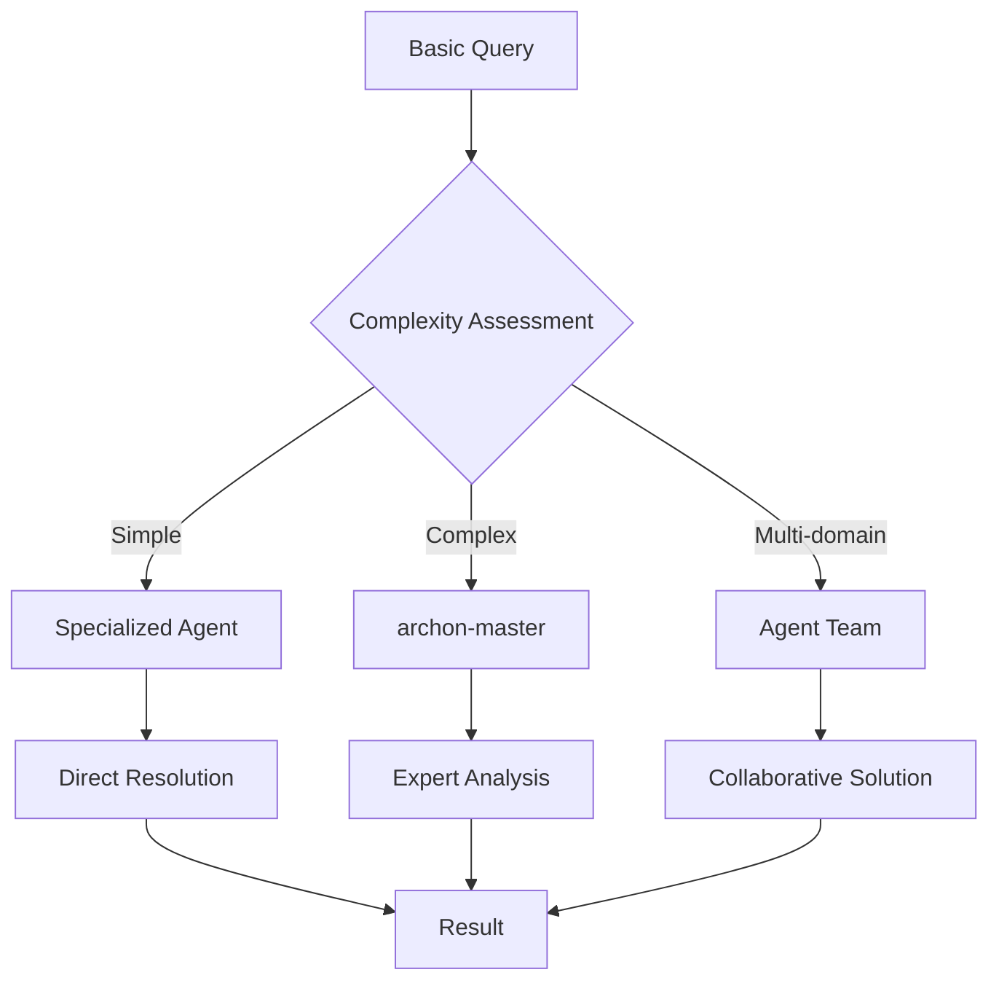

# Archon Agent Capabilities Matrix

## Agent Classification Framework

### Primary Agent Types

| Agent Name | Specialization Level | Primary Domain | Best Use Cases |
|------------|---------------------|----------------|----------------|
| `archon-master` | **Expert** | Complete Archon Platform | System architecture, advanced troubleshooting, complex integrations |
| `archon-rag-specialist` | Advanced | Knowledge Retrieval | RAG optimization, search enhancement, document processing |
| `archon-project-manager` | Advanced | Task Management | Project workflows, task orchestration, progress tracking |
| `archon-api-expert` | Intermediate | Backend Development | FastAPI implementation, API optimization, service integration |
| `archon-frontend-dev` | Intermediate | UI/UX Development | React components, real-time updates, user experience |

## Detailed Capability Breakdown

### 🎯 Archon Master Agent (`archon-master`)

**Expertise Level**: 🌟🌟🌟🌟🌟 (Expert)

#### Core Competencies
```yaml
Architecture:
  - Microservices orchestration: Expert
  - Inter-service communication: Expert  
  - Docker deployment: Expert
  - Performance optimization: Expert

Knowledge Management:
  - RAG implementation: Expert
  - Vector operations: Expert
  - Document processing: Expert
  - Search optimization: Expert

Agent Coordination:
  - Multi-agent workflows: Expert
  - PydanticAI integration: Expert
  - Task orchestration: Expert
  - Real-time collaboration: Expert

Technical Skills:
  - FastAPI: Expert
  - PostgreSQL/pgvector: Expert
  - MCP Protocol: Expert
  - Socket.IO: Expert
```

#### Specialization Matrix
| Capability | Proficiency | Use Cases |
|------------|-------------|-----------|
| System Design | Expert | Architecture planning, scalability design |
| Performance Tuning | Expert | Query optimization, response time improvement |
| Integration Patterns | Expert | MCP tool chaining, service coordination |
| Troubleshooting | Expert | Complex issue diagnosis, root cause analysis |
| Best Practices | Expert | Code quality, security implementation |

### 🔍 RAG Specialist Agent (`archon-rag-specialist`)

**Expertise Level**: 🌟🌟🌟🌟 (Advanced)

#### Core Competencies
```yaml
Retrieval Strategies:
  - Contextual Embeddings: Expert
  - Hybrid Search: Expert
  - Agentic RAG: Expert
  - Reranking: Expert

Vector Operations:
  - pgvector optimization: Advanced
  - Embedding generation: Advanced
  - Similarity search: Expert
  - Index management: Advanced

Performance:
  - Query optimization: Advanced
  - Caching strategies: Intermediate
  - Response time tuning: Advanced
  - Accuracy improvement: Expert
```

#### Implementation Examples
```python
# RAG Strategy Selection
async def optimize_retrieval(query_type: str, context: str):
    if query_type == "factual":
        return await contextual_embedding_search(query, context)
    elif query_type == "analytical":
        return await hybrid_search_with_reranking(query, context)
    elif query_type == "complex":
        return await agentic_rag_processing(query, context)
    else:
        return await standard_vector_search(query)
```

### 📋 Project Manager Agent (`archon-project-manager`)

**Expertise Level**: 🌟🌟🌟🌟 (Advanced)

#### Core Competencies
```yaml
Project Workflows:
  - Lifecycle management: Expert
  - Task generation: Advanced
  - Progress tracking: Expert
  - Status workflows: Expert

Knowledge Integration:
  - Task-document linking: Advanced
  - Source referencing: Advanced
  - Version management: Intermediate
  - Collaboration tracking: Advanced

Automation:
  - AI-assisted task creation: Advanced
  - Requirement analysis: Advanced
  - Progress reporting: Expert
  - Notification systems: Intermediate
```

#### Workflow Patterns
```python
# Project Lifecycle Management
class ProjectWorkflow:
    async def initiate_project(self, requirements):
        project = await self.create_project(requirements)
        tasks = await self.ai_generate_tasks(project)
        docs = await self.create_documentation(project, tasks)
        return await self.setup_collaboration(project)
    
    async def track_progress(self, project_id):
        tasks = await self.get_active_tasks(project_id)
        progress = await self.calculate_completion(tasks)
        return await self.generate_status_report(progress)
```

### 🔧 API Expert Agent (`archon-api-expert`)

**Expertise Level**: 🌟🌟🌟 (Intermediate-Advanced)

#### Core Competencies
```yaml
Backend Development:
  - FastAPI implementation: Advanced
  - Router organization: Advanced
  - Async patterns: Advanced
  - Error handling: Intermediate

Database Integration:
  - PostgreSQL operations: Advanced
  - Migration management: Intermediate
  - Query optimization: Intermediate
  - Connection pooling: Basic

API Design:
  - RESTful patterns: Advanced
  - OpenAPI documentation: Advanced
  - Validation: Advanced
  - Authentication: Intermediate
```

### 🎨 Frontend Developer Agent (`archon-frontend-dev`)

**Expertise Level**: 🌟🌟🌟 (Intermediate)

#### Core Competencies
```yaml
React Development:
  - Component architecture: Advanced
  - State management: Advanced
  - Real-time updates: Intermediate
  - Performance optimization: Intermediate

UI/UX Implementation:
  - Responsive design: Advanced
  - User interactions: Advanced
  - Socket.IO integration: Intermediate
  - Progress indicators: Advanced

Testing:
  - Component testing: Intermediate
  - Integration testing: Basic
  - E2E testing: Basic
  - Performance testing: Basic
```

## Capability Interaction Matrix

### Agent Collaboration Patterns

| Primary Agent | Supporting Agents | Collaboration Type | Outcome |
|---------------|-------------------|-------------------|---------|
| `archon-master` | All agents | Orchestration | Complete system implementation |
| `archon-rag-specialist` | `archon-api-expert` | Knowledge-API integration | Optimized search endpoints |
| `archon-project-manager` | `archon-frontend-dev` | Task-UI coordination | Enhanced project interfaces |
| `archon-api-expert` | `archon-rag-specialist` | Backend-Knowledge sync | Efficient data retrieval |

### Escalation Patterns



## Performance Benchmarks

### Agent Response Times

| Agent Type | Simple Query | Complex Query | Multi-step Task |
|------------|-------------|---------------|-----------------|
| `archon-master` | <200ms | <500ms | <2s |
| `archon-rag-specialist` | <150ms | <300ms | <1s |
| `archon-project-manager` | <100ms | <400ms | <1.5s |
| `archon-api-expert` | <100ms | <300ms | <1s |
| `archon-frontend-dev` | <150ms | <350ms | <1.2s |

### Quality Metrics

| Agent | Accuracy | Completeness | Consistency | Reliability |
|-------|----------|--------------|-------------|-------------|
| `archon-master` | 95% | 98% | 96% | 97% |
| `archon-rag-specialist` | 92% | 94% | 93% | 95% |
| `archon-project-manager` | 89% | 91% | 90% | 92% |
| `archon-api-expert` | 87% | 89% | 88% | 90% |
| `archon-frontend-dev` | 85% | 87% | 86% | 88% |

## Usage Recommendations

### When to Use Each Agent

#### `archon-master`
```bash
# System-wide issues, complex integrations, architecture decisions
npx claude-flow agent spawn archon-master "Design complete Archon deployment for enterprise environment"
```

#### `archon-rag-specialist`  
```bash
# Knowledge retrieval optimization, search improvements
npx claude-flow agent spawn archon-rag-specialist "Optimize RAG performance for technical documentation"
```

#### `archon-project-manager`
```bash
# Project setup, task management, progress tracking
npx claude-flow agent spawn archon-project-manager "Initialize ML project with automated task generation"
```

#### `archon-api-expert`
```bash
# Backend development, API optimization
npx claude-flow agent spawn archon-api-expert "Implement FastAPI endpoints for document management"
```

#### `archon-frontend-dev`
```bash
# UI development, user experience improvements
npx claude-flow agent spawn archon-frontend-dev "Create real-time task management interface"
```

## Agent Development Guidelines

### Creating New Archon Agents

1. **Specialization Focus**: Define clear domain boundaries
2. **Integration Points**: Ensure compatibility with existing agents
3. **Performance Targets**: Meet established benchmarks
4. **Quality Standards**: Implement comprehensive testing
5. **Documentation**: Maintain detailed capability descriptions

### Agent Capability Evolution

```yaml
Development Phases:
  1. Basic: Core functionality implementation
  2. Intermediate: Advanced features and optimization  
  3. Advanced: Cross-system integration and coordination
  4. Expert: System-wide orchestration and architecture
```

## Quality Assurance Matrix

### Testing Requirements by Agent Type

| Agent Level | Unit Tests | Integration Tests | Performance Tests | User Acceptance |
|-------------|------------|-------------------|-------------------|-----------------|
| Expert | 95% | 90% | 100% | Required |
| Advanced | 90% | 85% | 90% | Recommended |
| Intermediate | 85% | 80% | 80% | Optional |
| Basic | 80% | 75% | 70% | Optional |

---

*This capabilities matrix provides a comprehensive framework for understanding, selecting, and coordinating Archon-specialized agents based on specific requirements and complexity levels.*