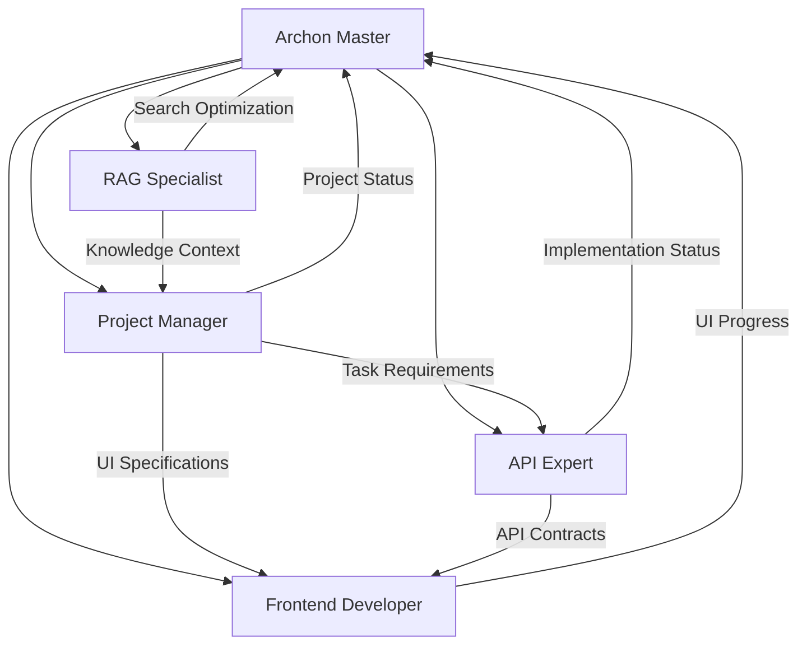

# Archon Agent Integration Patterns

## Integration Architecture Overview

The Archon platform provides multiple integration patterns for specialized agents, enabling seamless coordination between AI agents, knowledge systems, and task management workflows. This document outlines the comprehensive integration strategies available.

## Core Integration Protocols

### 1. MCP (Model Context Protocol) Integration

#### Primary MCP Tools for Archon Agents
```yaml
RAG Tools (7):
  - mcp__archon__perform_rag_query: Advanced knowledge retrieval
  - mcp__archon__search_code_examples: Code-specific search
  - mcp__archon__get_available_sources: Source inventory
  
Project Management Tools (7):
  - mcp__archon__create_project: Project initialization
  - mcp__archon__create_task: Task generation
  - mcp__archon__list_tasks: Task inventory
  - mcp__archon__update_task: Status management
  - mcp__archon__create_document: Documentation
  - mcp__archon__create_version: Version control
  - mcp__archon__get_project_features: Feature tracking
```

#### MCP Integration Pattern
```python
class ArchonAgentMCPIntegration:
    async def execute_archon_workflow(self, task_description: str):
        # Step 1: Research phase using RAG
        rag_results = await self.mcp_client.perform_rag_query(
            query=task_description,
            match_count=5
        )
        
        # Step 2: Code examples for context
        code_examples = await self.mcp_client.search_code_examples(
            query=f"{task_description} implementation patterns",
            match_count=3
        )
        
        # Step 3: Task creation and tracking
        task = await self.mcp_client.create_task(
            project_id=self.current_project,
            title=task_description,
            description=self.synthesize_requirements(rag_results, code_examples)
        )
        
        # Step 4: Implementation with progress tracking
        result = await self.implement_with_tracking(task, rag_results)
        
        # Step 5: Documentation and versioning
        await self.mcp_client.create_document(
            project_id=self.current_project,
            title=f"{task_description} - Implementation",
            content=result.documentation
        )
        
        return result
```

### 2. Claude Code Task Tool Integration

#### Agent Spawning Patterns
```javascript
// ✅ CORRECT: Concurrent agent spawning for Archon workflows
[Single Message - Parallel Archon Agent Execution]:
  Task("Archon Master", "Analyze system architecture and provide optimization recommendations. Use Archon knowledge base for context.", "archon-master")
  Task("RAG Specialist", "Optimize knowledge retrieval performance using RAG strategies. Target 40% improvement.", "archon-rag-specialist")  
  Task("Project Manager", "Generate comprehensive task breakdown for ML pipeline project.", "archon-project-manager")
  Task("API Expert", "Design FastAPI endpoints for document management system.", "archon-api-expert")
  Task("Frontend Developer", "Implement real-time UI components for task tracking.", "archon-frontend-dev")
  
  // Batch coordination todos
  TodoWrite { todos: [
    {content: "Initialize Archon project structure", status: "in_progress", activeForm: "Initializing Archon project structure"},
    {content: "Set up knowledge base integration", status: "pending", activeForm: "Setting up knowledge base integration"},
    {content: "Configure RAG optimization", status: "pending", activeForm: "Configuring RAG optimization"},
    {content: "Implement API endpoints", status: "pending", activeForm: "Implementing API endpoints"},
    {content: "Build real-time UI components", status: "pending", activeForm: "Building real-time UI components"},
    {content: "Test integration workflows", status: "pending", activeForm: "Testing integration workflows"},
    {content: "Deploy to production environment", status: "pending", activeForm: "Deploying to production environment"}
  ]}
```

### 3. Archon-Specific Integration Hooks

#### Pre-Task Coordination
```bash
# Every Archon agent MUST execute these coordination hooks
npx claude-flow@alpha hooks pre-task --description "Archon [agent-type] task" --project-context "archon-integration"
npx claude-flow@alpha hooks session-restore --session-id "archon-swarm-[project-id]"
```

#### During-Task Memory Integration
```bash
# Store Archon-specific knowledge and progress
npx claude-flow@alpha hooks post-edit --file "[file]" --memory-key "archon/[agent-type]/[step]"
npx claude-flow@alpha hooks memory-store --key "archon/rag/optimization" --value "{strategy: 'hybrid', improvement: '40%'}"
npx claude-flow@alpha hooks notify --message "Archon [component] completed: [details]"
```

#### Post-Task Integration
```bash
# Complete Archon workflow coordination
npx claude-flow@alpha hooks post-task --task-id "[archon-task]" --project-id "[project]"
npx claude-flow@alpha hooks session-end --export-metrics true --archon-context true
```

## Agent Coordination Patterns

### 1. Hierarchical Coordination (Recommended for Complex Projects)



#### Implementation Example
```python
async def hierarchical_archon_coordination(project_requirements):
    # Master agent orchestrates the workflow
    master_agent = await spawn_agent("archon-master", {
        "role": "coordinator",
        "project": project_requirements,
        "coordination_pattern": "hierarchical"
    })
    
    # Specialized agents report to master
    agents = await master_agent.spawn_specialized_team([
        {"type": "archon-rag-specialist", "focus": "knowledge_optimization"},
        {"type": "archon-project-manager", "focus": "workflow_management"},
        {"type": "archon-api-expert", "focus": "backend_implementation"},
        {"type": "archon-frontend-dev", "focus": "ui_development"}
    ])
    
    return await master_agent.orchestrate_workflow(agents)
```

### 2. Mesh Coordination (Optimal for Collaborative Development)

```python
async def mesh_archon_coordination(project_requirements):
    # All agents can communicate directly
    swarm = await initialize_mesh_swarm(topology="mesh", max_agents=5)
    
    agents = await parallel_spawn_agents([
        {"type": "archon-master", "coordination": "peer"},
        {"type": "archon-rag-specialist", "coordination": "peer"},
        {"type": "archon-project-manager", "coordination": "peer"},
        {"type": "archon-api-expert", "coordination": "peer"},
        {"type": "archon-frontend-dev", "coordination": "peer"}
    ])
    
    # Enable cross-agent memory sharing
    await setup_shared_memory_pool(agents, namespace="archon-mesh")
    
    return await collaborative_execution(agents, project_requirements)
```

### 3. Pipeline Coordination (Sequential Task Processing)

```python
async def pipeline_archon_coordination(requirements):
    pipeline = ArchonAgentPipeline([
        ("research", "archon-master", "analyze_requirements"),
        ("knowledge", "archon-rag-specialist", "optimize_retrieval"),
        ("planning", "archon-project-manager", "generate_tasks"),
        ("backend", "archon-api-expert", "implement_api"),
        ("frontend", "archon-frontend-dev", "build_interface")
    ])
    
    return await pipeline.execute_sequential(requirements)
```

## Memory and State Management

### Shared Memory Patterns

```python
class ArchonSharedMemory:
    async def store_project_context(self, project_id: str, context: dict):
        await self.memory.store(
            key=f"archon/project/{project_id}/context",
            value=context,
            ttl=86400  # 24 hours
        )
    
    async def store_rag_optimization(self, strategy: str, results: dict):
        await self.memory.store(
            key=f"archon/rag/{strategy}/results",
            value=results,
            namespace="optimization"
        )
    
    async def share_api_contracts(self, contracts: dict):
        await self.memory.store(
            key="archon/api/contracts",
            value=contracts,
            namespace="shared"
        )
```

### Cross-Agent State Synchronization

```python
async def synchronize_agent_states(agents: list):
    for agent in agents:
        # Get current state
        state = await agent.get_current_state()
        
        # Share with other agents
        await broadcast_state_update(
            sender=agent.id,
            state=state,
            recipients=[a.id for a in agents if a.id != agent.id]
        )
        
        # Update shared memory
        await update_shared_context(agent.type, state)
```

## Real-Time Communication Patterns

### Socket.IO Integration

```python
class ArchonRealtimeCoordination:
    def __init__(self):
        self.socketio = AsyncClient()
        
    async def join_project_room(self, project_id: str, agent_type: str):
        await self.socketio.connect("http://localhost:8080")
        await self.socketio.emit("join_room", {
            "room": f"archon_project_{project_id}",
            "agent_type": agent_type
        })
    
    async def broadcast_progress(self, project_id: str, progress: dict):
        await self.socketio.emit("progress_update", {
            "room": f"archon_project_{project_id}",
            "progress": progress
        }, to=f"archon_project_{project_id}")
    
    async def coordinate_task_assignment(self, project_id: str, task: dict):
        await self.socketio.emit("task_assignment", {
            "room": f"archon_project_{project_id}",
            "task": task
        }, to=f"archon_project_{project_id}")
```

## Error Handling and Recovery

### Fault-Tolerant Integration

```python
class ArchonFaultTolerance:
    async def execute_with_fallback(self, primary_agent: str, fallback_agent: str, task: dict):
        try:
            return await self.execute_agent_task(primary_agent, task)
        except AgentError as e:
            logging.warning(f"Primary agent {primary_agent} failed: {e}")
            
            # Fallback to alternative agent
            if fallback_agent:
                return await self.execute_agent_task(fallback_agent, task)
            
            # Final fallback to Archon Master
            return await self.execute_agent_task("archon-master", {
                **task,
                "context": f"Fallback execution after {primary_agent} failure"
            })
    
    async def recover_from_mcp_failure(self, last_successful_state: dict):
        # Restore from shared memory
        cached_state = await self.memory.retrieve("archon/last_known_state")
        
        # Reinitialize MCP connections
        await self.reinitialize_mcp_client()
        
        # Resume from last successful checkpoint
        return await self.resume_execution(cached_state)
```

## Performance Optimization Patterns

### Caching Strategies

```python
class ArchonCache:
    def __init__(self):
        self.rag_cache = TTLCache(maxsize=1000, ttl=3600)  # 1 hour
        self.project_cache = TTLCache(maxsize=100, ttl=7200)  # 2 hours
        self.agent_state_cache = TTLCache(maxsize=500, ttl=1800)  # 30 minutes
    
    async def cached_rag_query(self, query: str, match_count: int = 5):
        cache_key = f"rag:{hash(query)}:{match_count}"
        
        if cache_key in self.rag_cache:
            return self.rag_cache[cache_key]
        
        result = await self.mcp_client.perform_rag_query(query, match_count)
        self.rag_cache[cache_key] = result
        return result
```

### Batch Processing

```python
async def batch_archon_operations(operations: list):
    # Group operations by type
    rag_queries = [op for op in operations if op.type == "rag_query"]
    task_updates = [op for op in operations if op.type == "task_update"]
    document_creates = [op for op in operations if op.type == "document_create"]
    
    # Execute in parallel batches
    results = await asyncio.gather(
        process_rag_batch(rag_queries),
        process_task_batch(task_updates),
        process_document_batch(document_creates)
    )
    
    return combine_batch_results(results)
```

## Security and Authentication

### Secure Agent Communication

```python
class ArchonSecureIntegration:
    def __init__(self, api_key: str, project_id: str):
        self.api_key = api_key
        self.project_id = project_id
        self.session_token = None
    
    async def authenticate_agent(self, agent_type: str):
        self.session_token = await self.get_session_token(
            api_key=self.api_key,
            agent_type=agent_type,
            project_id=self.project_id
        )
        
        return self.session_token
    
    async def secure_mcp_call(self, method: str, **kwargs):
        headers = {
            "Authorization": f"Bearer {self.session_token}",
            "X-Agent-Type": self.agent_type,
            "X-Project-ID": self.project_id
        }
        
        return await self.mcp_client.call(method, headers=headers, **kwargs)
```

## Testing Integration Patterns

### Integration Test Framework

```python
class ArchonIntegrationTest:
    async def test_full_workflow_integration(self):
        # Setup test project
        project = await self.create_test_project()
        
        # Test agent coordination
        agents = await self.spawn_agent_team(project.id)
        
        # Execute test workflow
        results = await self.execute_test_workflow(agents)
        
        # Validate integration points
        assert await self.validate_mcp_integration(results)
        assert await self.validate_memory_sharing(agents)
        assert await self.validate_realtime_updates(project.id)
        
        # Cleanup
        await self.cleanup_test_resources(project.id, agents)
    
    async def test_fault_tolerance(self):
        # Simulate agent failures
        with pytest.raises(AgentError):
            await self.simulate_agent_failure("archon-rag-specialist")
        
        # Verify fallback behavior
        result = await self.verify_fallback_execution()
        assert result.success is True
        assert result.fallback_used is True
```

## Best Practices Summary

### Integration Checklist

- ✅ **MCP Tool Usage**: Utilize all 14 Archon-specific MCP tools appropriately
- ✅ **Concurrent Execution**: Always batch related operations in single messages
- ✅ **Memory Coordination**: Implement shared memory for cross-agent communication
- ✅ **Real-time Updates**: Use Socket.IO for live collaboration
- ✅ **Error Handling**: Implement comprehensive fallback strategies
- ✅ **Performance Optimization**: Use caching and batch processing
- ✅ **Security**: Secure all agent communications
- ✅ **Testing**: Comprehensive integration test coverage

### Common Anti-Patterns to Avoid

- ❌ **Sequential MCP Calls**: Don't make individual MCP calls when batch operations are possible
- ❌ **Memory Isolation**: Avoid agents operating in complete isolation
- ❌ **Synchronous Communication**: Don't block on real-time updates
- ❌ **Missing Fallbacks**: Always implement error recovery mechanisms
- ❌ **Cache Misuse**: Don't cache sensitive or rapidly changing data
- ❌ **Poor Coordination**: Ensure agents coordinate rather than conflict

---

*These integration patterns enable powerful, scalable, and reliable Archon agent coordination while maintaining performance, security, and maintainability standards.*