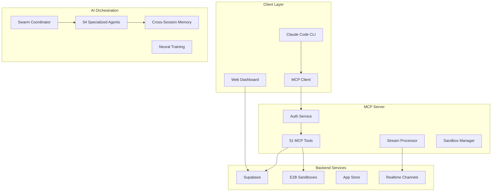

# 🌊 Flow-Nexus Platform Guide

*Source: [Flow-Nexus GitHub Gist](https://gist.github.com/ruvnet/51164b468c18db4ccd7b6aaad8b16c3d)*

## 🚀 Overview

Flow Nexus is a comprehensive AI-powered development platform that combines Claude Code, Claude Flow orchestration, and advanced swarm intelligence to revolutionize software development. Built on the Model Context Protocol (MCP) with Supabase backend and E2B sandbox execution, it provides a complete ecosystem for AI-assisted development, deployment, and collaboration.

### 🎯 Key Features

* **🤖 AI Swarm Orchestration** - Deploy multi-agent swarms with specialized roles
* **📦 Template Marketplace** - Pre-built templates for rapid deployment
* **🎮 Gamified Challenges** - Earn rUv credits through coding challenges
* **☁️ Cloud Sandboxes** - Secure E2B execution environments
* **🔄 Real-time Collaboration** - Live streaming and monitoring
* **🔐 Enterprise Security** - Multi-tenant architecture with RLS
* **📊 Advanced Analytics** - Performance metrics and usage tracking
* **🌐 GitHub Integration** - Seamless repository management

## 🏗️ Architecture



## 🔧 Installation

### Prerequisites

* Node.js 18+
* npm or pnpm
* Claude Code CLI
* Supabase account
* E2B API key (optional)

### Quick Start

```bash
# Clone the repository
git clone https://github.com/ruvnet/flow-cloud.git
cd flow-cloud

# Install dependencies
npm install

# Configure environment
cp flow/mcp-server/.env.example flow/mcp-server/.env
# Edit .env with your credentials

# Start MCP server
cd flow/mcp-server
npm start

# Add to Claude Code
claude mcp add flow-cloud "node /path/to/flow-cloud/flow/mcp-server/src/index.js"
```

## 💻 CLI Usage

### Claude Code Integration

```bash
# Deploy template with variables
claude "Deploy Claude Code template with my API key"

# Create and manage sandboxes
claude "Create a Python sandbox and run my script"

# Orchestrate AI swarms
claude "Initialize a mesh swarm with 5 agents to refactor my codebase"
```

### Claude Flow Commands

```bash
# Initialize swarm
npx claude-flow@alpha swarm init --topology mesh --agents 8

# Run SPARC methodology
npx claude-flow@alpha sparc tdd "implement user authentication"

# GitHub integration
npx claude-flow@alpha github init --repo owner/name --pat YOUR_PAT

# Real-time monitoring
npx claude-flow@alpha monitor --stream-id abc123
```

## 🔌 MCP Server

### Available Tools (51 Total)

#### Connect to Arena

```bash
flow-nexus mcp connect --user your@email.com
```

#### Check Arena Status

```bash
flow-nexus mcp arena --verbose
```

#### Deploy Agent Swarms

```bash
# Deploy a combat swarm
flow-nexus mcp deploy combat-swarm --size 5 --tactics adaptive

# Deploy for specific battle mode
flow-nexus mcp deploy neural-net --battle-mode tournament
```

#### Battle Management

```bash
# Start a battle
flow-nexus mcp battle start --mode algorithm-duel --opponent rival_player

# Check battle status
flow-nexus mcp battle status --id battle_123

# Join an existing battle
flow-nexus mcp battle join --id battle_456

# Spectate live battles
flow-nexus mcp battle spectate --id battle_789 --follow
```

#### Challenge System

```bash
# List available challenges
flow-nexus mcp challenge list --difficulty hard

# View active challenges
flow-nexus mcp challenge active

# Check leaderboards
flow-nexus mcp challenge leaderboard --type weekly
```

#### Agent Marketplace

```bash
# Browse marketplace
flow-nexus mcp marketplace browse --category combat --sort rating

# View featured agents
flow-nexus mcp marketplace featured

# Check your marketplace agents
flow-nexus mcp marketplace my-agents
```

#### Player Profile

```bash
# View your profile
flow-nexus mcp profile

# View another player's profile
flow-nexus mcp profile --player champion_player
```

#### Live Battle Spectating

```bash
# Watch a battle in real-time
flow-nexus mcp spectate battle_123 --follow
```

## 🤖 Swarm Management

### Initialize Swarms

```bash
# Create a hierarchical swarm
flow-nexus swarm init --topology hierarchical --max-agents 8

# Create a mesh network swarm
flow-nexus swarm init --topology mesh --strategy adaptive
```

### Spawn Agents

```bash
# Spawn a researcher agent
flow-nexus swarm spawn researcher --name "DataAnalyst"

# Spawn with specific capabilities
flow-nexus swarm spawn coder --capabilities "python,nodejs,typescript"
```

### Task Orchestration

```bash
# Orchestrate a complex task
flow-nexus swarm task "Analyze user data and generate insights" --priority high

# Monitor task progress
flow-nexus swarm task-status task_123 --follow
```

### Swarm Status

```bash
# List all swarms
flow-nexus swarm status

# Get detailed swarm info
flow-nexus swarm status --id swarm_456 --verbose

# List all agents
flow-nexus swarm agents --type researcher
```

## 🛠️ Tools & Resources

### List Available Tools

```bash
# Show all tools
flow-nexus tools list

# Filter by category
flow-nexus tools list --category analysis

# Search tools
flow-nexus tools list --search "optimize"
```

### Execute Tools

```bash
# Run a tool with parameters
flow-nexus tools run swarm-analyzer --params '{"swarmId": "swarm_123"}'

# Interactive parameter input
flow-nexus tools run agent-optimizer --interactive

# Dry run to validate parameters
flow-nexus tools run battle-simulator --dry-run
```

### Resource Management

```bash
# List available resources
flow-nexus resources list

# Read resource content
flow-nexus resources read flow-nexus://agents/combat/default-config

# Get resource information
flow-nexus resources info flow-nexus://battles/logs/recent

# Watch resource for changes
flow-nexus resources watch flow-nexus://challenges/active
```

## ⚙️ Configuration

### Initialize Configuration

```bash
flow-nexus config init
```

### Manage Settings

```bash
# Set configuration values
flow-nexus config set apiEndpoint https://api.flow-nexus.com
flow-nexus config set logLevel debug

# Get configuration
flow-nexus config get apiEndpoint
flow-nexus config list

# Reset to defaults
flow-nexus config reset --force
```

## 🔐 Authentication

### Login

```bash
# Interactive login
flow-nexus auth login

# Direct login
flow-nexus auth login --email user@example.com --password mypassword

# Token-based login
flow-nexus auth login --token your_api_token
```

### Account Management

```bash
# Check authentication status
flow-nexus auth status

# View user profile
flow-nexus auth profile

# Register new account
flow-nexus auth register

# Logout
flow-nexus auth logout
```

## 🎨 Output Formats

Most commands support different output formats:

```bash
# Table format (default)
flow-nexus swarm status

# JSON format
flow-nexus swarm status --format json

# Minimal format
flow-nexus tools list --format minimal
```

## 🔧 Configuration Options

### Global Options

* `--verbose, -v`: Enable verbose logging
* `--no-color`: Disable colored output
* `--config <path>`: Use custom config file

### Environment Variables

```bash
export FLOW_NEXUS_API_KEY="your_api_key"
export FLOW_NEXUS_ENDPOINT="https://api.flow-nexus.com"
export FLOW_NEXUS_LOG_LEVEL="info"
```

### Configuration File

FLOW NEXUS stores configuration in `~/.flow-nexus/config.json`:

```json
{
  "apiEndpoint": "https://api.flow-nexus.com",
  "mcpPort": 3000,
  "logLevel": "info",
  "autoUpdate": true,
  "defaultSwarmTopology": "hierarchical"
}
```

## 🎮 Gaming Features

### Player Classes

Choose your hacker class:

* **Algorithmic Warrior**: Combat-focused agent battles
* **Neural Architect**: Advanced AI model design
* **Swarm Commander**: Multi-agent coordination
* **Code Ninja**: Rapid development and optimization
* **Data Wizard**: Analytics and insights
* **System Hacker**: Infrastructure and security

### Agent Rarities

Collect agents of different rarities:

* **Common**: Basic functionality
* **Uncommon**: Enhanced capabilities
* **Rare**: Specialized skills
* **Epic**: Advanced features
* **Legendary**: Unique abilities
* **Mythic**: Game-changing powers

### Battle Modes

Engage in various battle types:

* **Algorithm Duel**: 1v1 agent combat
* **Swarm War**: Team-based battles
* **Tournament**: Elimination-style competition
* **Training**: Practice and improvement
* **Challenge**: Special event battles

### rUv Economy

Earn and spend rUv credits:

* **Battle Rewards**: Win battles to earn rUv
* **Challenge Prizes**: Complete challenges for bonuses
* **Agent Sales**: Sell agents in the marketplace
* **Tournament Winnings**: Compete for large prize pools

## 🚨 Troubleshooting

### Common Issues

#### Permission Errors

```bash
# Fix NPX permissions
npm config set prefix ~/.npm-global
export PATH=~/.npm-global/bin:$PATH
```

#### Connection Issues

```bash
# Check your internet connection
flow-nexus mcp arena

# Verify API endpoint
flow-nexus config get apiEndpoint
```

#### Authentication Problems

```bash
# Clear and re-authenticate
flow-nexus auth logout
flow-nexus auth login
```

### Debug Mode

Enable verbose logging for troubleshooting:

```bash
flow-nexus --verbose mcp connect
```

### Log Files

Logs are stored in `~/.flow-nexus/logs/`:

* `flow-nexus.log`: Application logs
* `error.log`: Error logs
* `debug.log`: Debug information

## 📖 Advanced Usage

### Batch Operations

Execute multiple commands in sequence:

```bash
# Create and deploy a complete swarm
flow-nexus swarm init --topology mesh && \
flow-nexus swarm spawn researcher --name "Analyst1" && \
flow-nexus swarm spawn coder --name "Developer1" && \
flow-nexus swarm task "Build user dashboard"
```

### Automation Scripts

Create shell scripts for common workflows:

```bash
#!/bin/bash
# deploy-battle-swarm.sh

echo "🚀 Deploying battle-ready swarm..."
flow-nexus mcp connect
flow-nexus mcp deploy combat-swarm --size 5 --tactics aggressive
flow-nexus mcp battle start --mode swarm-war
echo "⚔️ Battle swarm deployed and ready!"
```

### Configuration Profiles

Use different configurations for different environments:

```bash
# Development profile
flow-nexus --config ~/.flow-nexus/dev-config.json mcp connect

# Production profile
flow-nexus --config ~/.flow-nexus/prod-config.json mcp arena
```

## 🔗 Integration

### CI/CD Integration

Use FLOW NEXUS in your CI/CD pipelines:

```yaml
# GitHub Actions example
- name: Deploy Testing Swarm
  run: |
    npx flow-nexus auth login --token ${{ secrets.FLOW_NEXUS_TOKEN }}
    npx flow-nexus swarm init --topology hierarchical
    npx flow-nexus swarm task "Run automated tests"
```

### API Integration

FLOW NEXUS CLI complements the FLOW NEXUS API:

```javascript
// Use with Node.js applications
const { exec } = require('child_process');

exec('flow-nexus mcp arena', (error, stdout, stderr) => {
  console.log('Arena Status:', stdout);
});
```

## 🤝 Contributing

We welcome contributions to FLOW NEXUS! Here's how to get started:

1. **Fork the Repository**
2. **Create a Feature Branch**: `git checkout -b feature/amazing-feature`
3. **Make Changes**: Implement your feature or fix
4. **Add Tests**: Ensure your changes are tested
5. **Commit Changes**: `git commit -m 'Add amazing feature'`
6. **Push to Branch**: `git push origin feature/amazing-feature`
7. **Open Pull Request**: Submit your changes for review

### Development Setup

```bash
# Clone the repository
git clone https://github.com/ruvnet/flow-nexus.git
cd flow-nexus

# Install dependencies
npm install

# Build the project
npm run build

# Test the CLI
node dist/cli.js --help
```

### Code Style

* Use TypeScript for type safety
* Follow ESLint configuration
* Write comprehensive tests
* Document new features
* Maintain backwards compatibility

## 📄 License

FLOW NEXUS is released under the MIT License.

## 🌟 Support

### Community

* **GitHub Issues**: Report bugs and request features
* **Discussions**: Join community discussions
* **Discord**: Join our Discord server

### Documentation

* **API Reference**: Complete API documentation
* **Tutorials**: Step-by-step guides
* **Examples**: Code examples and use cases

### Professional Support

For enterprise support and custom development:

* **Email**: support@flow-nexus.com
* **Website**: https://flow-nexus.com

---

**Ready to enter the Arena?** 🎮

```bash
npx flow-nexus mcp connect
```

**Welcome to FLOW NEXUS - Where Digital Agents Battle, Build & Evolve!** ⚔️🤖✨
