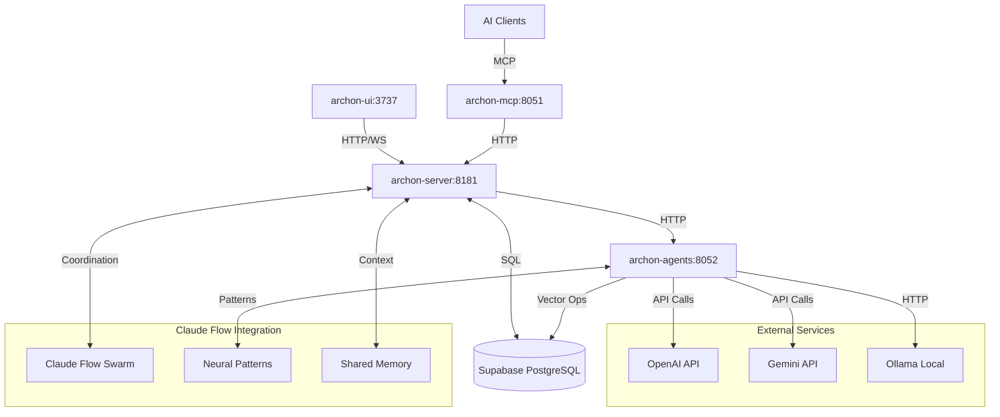
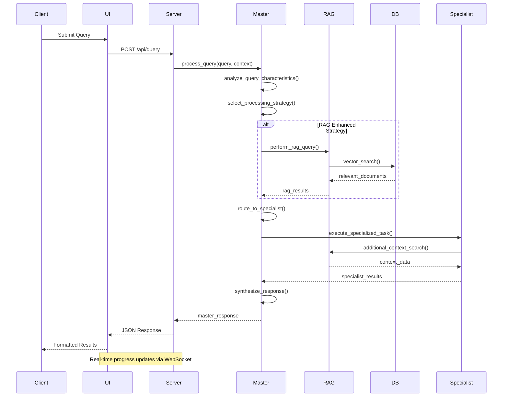
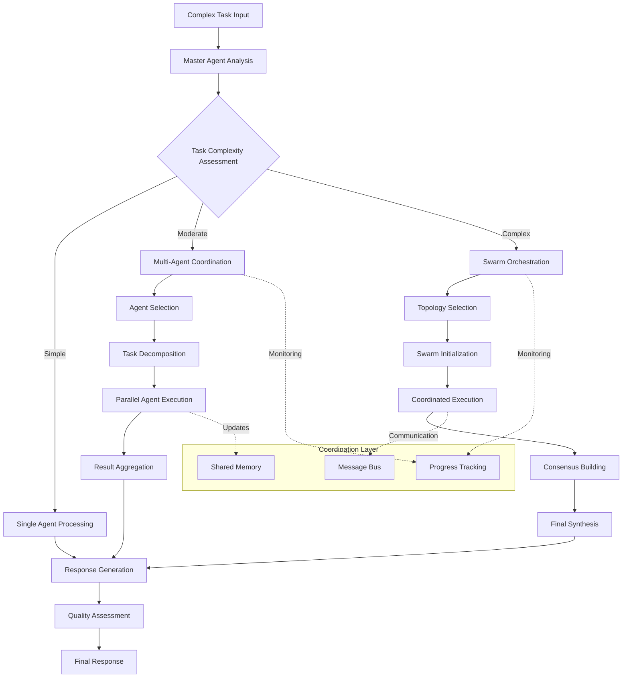
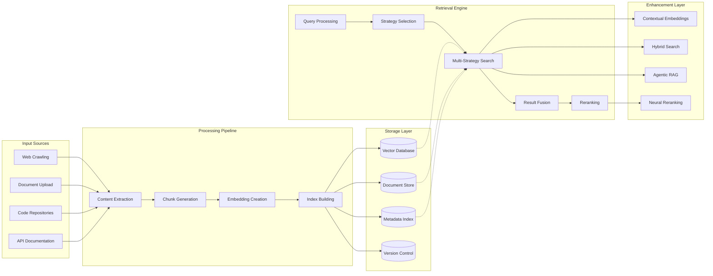

# Master Agent System - Architecture Documentation

## Table of Contents

- [System Overview](#system-overview)
- [Component Architecture](#component-architecture)
- [Data Flow Diagrams](#data-flow-diagrams)
- [Design Decisions](#design-decisions)
- [Scalability Considerations](#scalability-considerations)
- [Integration Architecture](#integration-architecture)
- [Security Architecture](#security-architecture)

---

## System Overview

The Archon Master Agent System represents a sophisticated AI orchestration platform that combines expert-level agents, progressive refinement protocols, and intelligent knowledge management. The system is built on microservices architecture principles with clear separation of concerns and optimized for both development flexibility and production scalability.

### High-Level Architecture

```
┌─────────────────────────────────────────────────────────────────────────────────┐
│                           ARCHON MASTER AGENT SYSTEM                           │
├─────────────────────────────────────────────────────────────────────────────────┤
│                                                                                 │
│  ┌─────────────────┐  ┌─────────────────┐  ┌─────────────────┐  ┌─────────────┐ │
│  │   CLIENT LAYER  │  │ COORDINATION    │  │  INTELLIGENCE   │  │    DATA     │ │
│  │                 │  │     LAYER       │  │     LAYER       │  │   LAYER     │ │
│  │ • Web UI        │  │ • Master Agent  │  │ • RAG Engines   │  │ • Vector DB │ │
│  │ • MCP Clients   │  │ • Swarm Coord   │  │ • Specialist    │  │ • Knowledge │ │
│  │ • AI Assistants │  │ • Task Orchestr │  │   Agents        │  │   Base      │ │
│  │ • APIs          │  │ • Memory Mgmt   │  │ • Neural Models │  │ • Memory    │ │
│  └─────────────────┘  └─────────────────┘  └─────────────────┘  └─────────────┘ │
│           │                      │                      │                │      │
│           └──────────────────────┼──────────────────────┼────────────────┘      │
│                                  │                      │                       │
│  ┌─────────────────────────────────────────────────────────────────────────────┐ │
│  │                        INTEGRATION FABRIC                                   │ │
│  │  • HTTP/REST APIs  • WebSocket/Real-time  • MCP Protocol  • Database       │ │
│  └─────────────────────────────────────────────────────────────────────────────┘ │
│                                                                                 │
├─────────────────────────────────────────────────────────────────────────────────┤
│                            INFRASTRUCTURE LAYER                                │
│  • Docker Containers  • Service Discovery  • Load Balancing  • Monitoring     │
└─────────────────────────────────────────────────────────────────────────────────┘
```

### Core Architectural Principles

1. **Microservices Architecture**: Independent, loosely coupled services with clear boundaries
2. **Event-Driven Communication**: Asynchronous messaging with real-time coordination
3. **Progressive Refinement**: Iterative improvement through feedback loops
4. **Intelligent Routing**: Dynamic agent selection based on capability matching
5. **Knowledge Amplification**: RAG-enhanced processing with continuous learning
6. **Scalable Design**: Horizontal scaling with performance optimization

---

## Component Architecture

### Core Components

#### 1. Master Agent Orchestrator

**Purpose**: Central coordination and intelligent routing for all AI operations

```yaml
Component: Master Agent
Location: /python/src/agents/master/
Key Files:
  - master_agent.py          # Core orchestration logic
  - capability_matrix.py     # Agent selection and routing
  - coordination_hooks.py    # Swarm integration
  - fallback_strategies.py   # Error handling and recovery

Responsibilities:
  - Query analysis and strategy selection
  - Agent capability matching and routing
  - Multi-agent workflow coordination
  - Performance monitoring and optimization
  - Fallback handling and error recovery

Interfaces:
  - REST API endpoints for query processing
  - WebSocket for real-time coordination
  - MCP protocol for client integration
  - Database for persistence and retrieval
```

**Architecture Details:**

```python
class MasterAgent:
    """
    Core orchestration engine with multiple processing strategies.
    
    Processing Flow:
    1. Query Analysis → Classify query type and complexity
    2. Strategy Selection → Choose optimal processing approach  
    3. Agent Routing → Select best-fit specialist agents
    4. Execution Coordination → Manage multi-agent workflows
    5. Response Synthesis → Aggregate and optimize results
    """
    
    # Core components
    capability_matrix: AgentCapabilityMatrix    # Agent selection logic
    coordinator: ClaudeFlowCoordinator         # Swarm coordination
    fallback_manager: FallbackManager          # Error handling
    performance_tracker: PerformanceTracker   # Metrics collection
    
    # Processing strategies
    strategies = {
        ProcessingStrategy.SINGLE_AGENT: SingleAgentProcessor,
        ProcessingStrategy.MULTI_AGENT: MultiAgentProcessor, 
        ProcessingStrategy.RAG_ENHANCED: RAGEnhancedProcessor,
        ProcessingStrategy.HYBRID: HybridProcessor
    }
```

#### 2. Agent Capability Matrix

**Purpose**: Intelligent agent selection and capability-based routing system

```yaml
Component: Capability Matrix
Architecture Pattern: Strategy + Factory Pattern
Key Features:
  - Dynamic agent capability assessment
  - Performance-based routing optimization
  - Real-time capability learning and adaptation
  - Multi-dimensional agent scoring

Agent Categories:
  Expert Level (95%+ accuracy):
    - archon-master: Complete system orchestration
    - serena-master: Semantic code intelligence
    
  Advanced Level (90%+ accuracy):
    - archon-rag-specialist: Knowledge retrieval optimization
    - archon-project-manager: Task management workflows
    
  Intermediate Level (85%+ accuracy):
    - archon-api-expert: Backend development
    - archon-frontend-dev: UI/UX implementation

Routing Algorithm:
  1. Query Analysis → Extract requirements and context
  2. Capability Matching → Score agents against requirements
  3. Performance Weighting → Factor in historical performance
  4. Load Balancing → Consider current agent utilization
  5. Selection → Choose optimal agent with confidence score
```

**Capability Scoring Algorithm:**

```python
def calculate_agent_score(
    agent: str,
    query_requirements: Dict[str, float],
    performance_history: List[Metric]
) -> float:
    """
    Multi-factor agent scoring for optimal selection.
    
    Scoring Components:
    - Capability Match (50%): Direct skill alignment
    - Performance History (30%): Success rate and response time
    - Current Load (10%): Available capacity
    - Specialization Depth (10%): Domain expertise level
    """
    
    capability_score = compute_capability_match(agent, query_requirements)
    performance_score = compute_performance_score(performance_history)
    load_score = compute_load_score(agent)
    specialization_score = get_specialization_depth(agent, query_requirements)
    
    return (
        capability_score * 0.5 +
        performance_score * 0.3 +
        load_score * 0.1 +
        specialization_score * 0.1
    )
```

#### 3. RAG Intelligence Engine

**Purpose**: Advanced knowledge retrieval with multiple enhancement strategies

```yaml
Component: RAG Engine
Architecture Pattern: Strategy + Chain of Responsibility
Location: Integrated across agents and MCP tools

RAG Strategy Hierarchy:
  1. Contextual Embeddings (~30% improvement):
     - Context-aware embedding generation
     - Query expansion with domain knowledge
     - Semantic similarity optimization
     
  2. Hybrid Search (~20% improvement):
     - Combines semantic and keyword search
     - BM25 + vector similarity scoring
     - Dynamic weight adjustment
     
  3. Agentic RAG (~40% improvement):
     - Multi-step reasoning and refinement
     - Query decomposition and reconstruction
     - Iterative result improvement
     
  4. Reranking (~25% improvement):
     - Cross-encoder result reordering
     - Relevance score calibration
     - Context-aware ranking adjustment

Processing Pipeline:
  Query → Preprocessing → Strategy Selection → Multi-Strategy Execution → 
  Result Fusion → Reranking → Post-processing → Response
```

**RAG Architecture Implementation:**

```python
class RAGIntelligenceEngine:
    """
    Multi-strategy RAG processing with adaptive optimization.
    """
    
    def __init__(self):
        self.strategies = {
            "contextual": ContextualEmbeddingStrategy(),
            "hybrid": HybridSearchStrategy(),
            "agentic": AgenticRAGStrategy(),
            "reranking": RerankerStrategy()
        }
        
    async def process_query(
        self,
        query: str,
        context: Dict[str, Any],
        strategy_config: RAGConfig
    ) -> RAGResponse:
        """
        Execute multi-strategy RAG processing.
        
        Flow:
        1. Query Analysis → Determine optimal strategy combination
        2. Parallel Execution → Run multiple strategies concurrently
        3. Result Fusion → Combine and deduplicate results
        4. Quality Assessment → Score and filter results
        5. Response Generation → Format final response
        """
        
        # Strategy selection based on query characteristics
        selected_strategies = await self.select_strategies(query, context)
        
        # Execute strategies in parallel
        strategy_results = await asyncio.gather(*[
            self.strategies[strategy].execute(query, context)
            for strategy in selected_strategies
        ])
        
        # Fuse results with intelligent deduplication
        fused_results = await self.fuse_results(strategy_results)
        
        # Apply reranking for final optimization
        final_results = await self.rerank_results(fused_results, query)
        
        return RAGResponse(
            results=final_results,
            strategies_used=selected_strategies,
            confidence=self.calculate_confidence(final_results),
            metadata=self.generate_metadata(strategy_results)
        )
```

#### 4. Swarm Coordination Framework

**Purpose**: Multi-agent coordination with Claude Flow integration

```yaml
Component: Swarm Coordinator
Integration: Claude Flow v2.0.0
Architecture Pattern: Coordinator + Observer Pattern

Coordination Topologies:
  1. Hierarchical:
     - Master-Specialist-Worker hierarchy
     - Clear command and control structure
     - Optimized for complex task decomposition
     
  2. Mesh Network:
     - Peer-to-peer agent communication
     - Distributed decision making
     - High fault tolerance and scalability
     
  3. Adaptive Topology:
     - Dynamic topology selection
     - Self-optimizing based on task characteristics
     - Performance-driven reconfiguration

Coordination Features:
  - Real-time agent communication
  - Shared memory and context management
  - Distributed task execution
  - Consensus building mechanisms
  - Failure detection and recovery
```

**Swarm Architecture Details:**

```python
class SwarmCoordinationFramework:
    """
    Advanced multi-agent coordination with adaptive topologies.
    """
    
    def __init__(self):
        self.topology_manager = TopologyManager()
        self.communication_bus = MessageBus()
        self.shared_memory = SharedMemoryManager()
        self.consensus_engine = ConsensusEngine()
        
    async def coordinate_complex_task(
        self,
        task: ComplexTask,
        coordination_strategy: CoordinationStrategy
    ) -> CoordinationResult:
        """
        Coordinate complex multi-agent task execution.
        
        Coordination Flow:
        1. Task Analysis → Decompose into agent-specific subtasks
        2. Topology Selection → Choose optimal coordination topology
        3. Agent Spawning → Deploy specialized agents
        4. Communication Setup → Establish coordination channels
        5. Execution Monitoring → Track progress and performance
        6. Result Synthesis → Aggregate agent outputs
        """
        
        # Analyze task complexity and requirements
        task_analysis = await self.analyze_task_requirements(task)
        
        # Select optimal topology
        topology = await self.topology_manager.select_topology(
            task_analysis,
            coordination_strategy
        )
        
        # Deploy coordinated agents
        agent_swarm = await self.deploy_agent_swarm(
            task_analysis.required_agents,
            topology
        )
        
        # Execute coordinated workflow
        coordination_result = await self.execute_coordinated_workflow(
            agent_swarm,
            task,
            topology
        )
        
        return coordination_result
```

### Service Architecture

#### Microservices Design

```yaml
Service Architecture:
  archon-server (Port 8181):
    Purpose: Core business logic and API orchestration
    Technologies: FastAPI, SQLAlchemy, Socket.IO
    Responsibilities:
      - HTTP API endpoints
      - Business logic processing  
      - Real-time WebSocket communication
      - Database operations
      - Service coordination
    
  archon-mcp (Port 8051):
    Purpose: Model Context Protocol interface
    Technologies: FastAPI, MCP Protocol, HTTP
    Responsibilities:
      - MCP tool registration and management
      - Client session management
      - Protocol translation
      - Tool execution coordination
    
  archon-agents (Port 8052):
    Purpose: AI agent hosting and execution
    Technologies: PydanticAI, asyncio, ML frameworks
    Responsibilities:
      - Agent lifecycle management
      - AI model integration
      - Streaming response handling
      - Performance monitoring
    
  archon-ui (Port 3737):
    Purpose: Web interface and user interaction
    Technologies: React, TypeScript, Socket.IO Client
    Responsibilities:
      - User interface rendering
      - Real-time updates
      - Client-side state management
      - API interaction

Communication Patterns:
  Synchronous: HTTP REST APIs for request-response patterns
  Asynchronous: Socket.IO for real-time updates and coordination
  Protocol: MCP for AI client integration
  Database: PostgreSQL with pgvector for data persistence
```

#### Service Interaction Diagram



---

## Data Flow Diagrams

### Primary Query Processing Flow



### Multi-Agent Coordination Flow



### Knowledge Management Data Flow



### Real-Time Communication Architecture

```mermaid
graph TB
    subgraph "Client Layer"
        WUI[Web UI]
        MCP[MCP Clients]
        API[API Clients]
    end
    
    subgraph "Communication Layer"
        WS[WebSocket Server]
        HTTP[HTTP Server]
        MCPS[MCP Server]
    end
    
    subgraph "Processing Layer"
        MASTER[Master Agent]
        AGENTS[Specialist Agents]
        COORD[Swarm Coordinator]
    end
    
    subgraph "Data Layer"
        MEMORY[Shared Memory]
        CACHE[Response Cache]
        METRICS[Performance Metrics]
    end
    
    WUI <-->|Socket.IO| WS
    MCP <-->|MCP Protocol| MCPS
    API <-->|REST| HTTP
    
    WS --> MASTER
    HTTP --> MASTER
    MCPS --> MASTER
    
    MASTER <--> AGENTS
    MASTER <--> COORD
    AGENTS <--> COORD
    
    MASTER <--> MEMORY
    AGENTS <--> MEMORY
    COORD <--> MEMORY
    
    MASTER --> CACHE
    AGENTS --> METRICS
    
    Note over WS,HTTP: Real-time progress updates
    Note over MASTER,COORD: Agent coordination messages
    Note over MEMORY,METRICS: Shared state and monitoring
```

---

## Design Decisions

### Architectural Decision Records (ADRs)

#### ADR-001: Microservices vs Monolithic Architecture

**Status**: Accepted  
**Date**: 2024-09-01  
**Context**: Need to balance development simplicity with scalability and deployment flexibility.

**Decision**: Adopt microservices architecture with clear service boundaries.

**Rationale**:
- **Scalability**: Independent scaling of services based on load patterns
- **Technology Diversity**: Optimal technology stack per service (React for UI, FastAPI for API, etc.)
- **Development Velocity**: Teams can work independently on different services
- **Deployment Flexibility**: Independent deployment and rollback capabilities
- **Fault Isolation**: Service failures don't cascade to entire system

**Consequences**:
- ✅ Better scalability and maintainability
- ✅ Technology optimization per service
- ✅ Independent deployment cycles
- ❌ Increased complexity in service coordination
- ❌ Network communication overhead
- ❌ Distributed system debugging challenges

**Implementation**:
```yaml
Service Boundaries:
  - archon-server: Business logic and API orchestration
  - archon-mcp: MCP protocol interface and tool management
  - archon-agents: AI agent execution and ML operations
  - archon-ui: Web interface and real-time updates

Communication Strategy:
  - HTTP REST for synchronous operations
  - WebSocket for real-time updates
  - MCP Protocol for AI client integration
  - Shared database for persistence
```

#### ADR-002: RAG Strategy Architecture

**Status**: Accepted  
**Date**: 2024-09-01  
**Context**: Need to optimize knowledge retrieval accuracy while maintaining performance.

**Decision**: Implement multi-strategy RAG approach with adaptive selection.

**Rationale**:
- **Accuracy Optimization**: Different strategies excel in different scenarios
- **Performance Flexibility**: Can balance accuracy vs speed based on requirements
- **Future-Proofing**: Easy to add new strategies as they emerge
- **Measurable Improvement**: Each strategy provides quantifiable benefits

**Strategies Implemented**:
1. **Contextual Embeddings** (~30% accuracy improvement)
   - Context-aware embedding generation
   - Domain-specific optimization
   
2. **Hybrid Search** (~20% accuracy improvement)  
   - Semantic + keyword search combination
   - Dynamic weight adjustment
   
3. **Agentic RAG** (~40% accuracy improvement)
   - Multi-step reasoning and refinement
   - Query decomposition and reconstruction
   
4. **Reranking** (~25% accuracy improvement)
   - Cross-encoder result reordering
   - Context-aware relevance scoring

**Implementation Architecture**:
```python
class RAGStrategyEngine:
    strategies = {
        "contextual": ContextualEmbeddingStrategy,
        "hybrid": HybridSearchStrategy,
        "agentic": AgenticRAGStrategy,
        "reranking": RerankerStrategy
    }
    
    async def execute_adaptive_rag(self, query, context):
        # Select optimal strategy combination
        selected_strategies = await self.select_strategies(query, context)
        
        # Execute in parallel
        results = await asyncio.gather(*[
            strategy.execute(query, context) 
            for strategy in selected_strategies
        ])
        
        # Fuse and optimize results
        return await self.fuse_and_rerank(results, query)
```

#### ADR-003: Agent Capability Matrix Design

**Status**: Accepted  
**Date**: 2024-09-01  
**Context**: Need intelligent agent selection and routing for optimal task performance.

**Decision**: Implement dynamic capability matrix with performance-based routing.

**Rationale**:
- **Optimal Resource Utilization**: Route queries to most capable agents
- **Performance Optimization**: Factor in historical performance data
- **Scalability**: Support for new agent types without architecture changes
- **Load Balancing**: Distribute load based on agent capacity and performance

**Design Components**:
```python
class AgentCapabilityMatrix:
    # Multi-dimensional capability assessment
    capabilities = {
        "archon-master": {
            "domains": ["architecture", "integration", "optimization"],
            "complexity_handling": "expert",
            "performance_targets": {"simple": "200ms", "complex": "500ms"}
        },
        "archon-rag-specialist": {
            "domains": ["knowledge_retrieval", "search_optimization"], 
            "complexity_handling": "advanced",
            "performance_targets": {"simple": "150ms", "complex": "300ms"}
        }
    }
    
    def route_query(self, query, context):
        # Score agents based on capability match and performance
        scores = {}
        for agent, caps in self.capabilities.items():
            capability_score = self.score_capability_match(agent, query)
            performance_score = self.get_performance_score(agent)
            load_score = self.get_current_load_score(agent)
            
            scores[agent] = (
                capability_score * 0.5 +
                performance_score * 0.3 + 
                load_score * 0.2
            )
        
        return max(scores, key=scores.get)
```

#### ADR-004: Real-Time Communication Strategy

**Status**: Accepted  
**Date**: 2024-09-01  
**Context**: Need real-time updates for long-running AI operations and multi-user collaboration.

**Decision**: Implement WebSocket-based real-time communication with Socket.IO.

**Rationale**:
- **User Experience**: Immediate feedback for long-running operations
- **Progress Tracking**: Real-time progress updates for complex tasks
- **Collaboration**: Multi-user real-time coordination
- **Resource Efficiency**: Persistent connections reduce overhead

**Implementation Strategy**:
```python
# Real-time coordination architecture
class RealtimeCoordinator:
    def __init__(self):
        self.socketio = SocketIO(cors_allowed_origins="*")
        self.room_manager = RoomManager()
        
    async def broadcast_agent_progress(self, session_id, progress):
        await self.socketio.emit('agent_progress', {
            'session_id': session_id,
            'progress': progress,
            'timestamp': datetime.utcnow().isoformat()
        }, room=f"session_{session_id}")
        
    async def coordinate_multi_agent_session(self, session_id, agents):
        # Create coordination room
        room = await self.room_manager.create_room(session_id)
        
        # Setup agent communication channels
        for agent in agents:
            await self.setup_agent_communication(agent, room)
            
        # Monitor and broadcast coordination events
        await self.monitor_coordination_events(session_id)
```

#### ADR-005: Database and Persistence Strategy

**Status**: Accepted  
**Date**: 2024-09-01  
**Context**: Need to support both relational data and vector operations for RAG functionality.

**Decision**: Use PostgreSQL with pgvector extension for unified data management.

**Rationale**:
- **Unified Platform**: Single database for relational and vector data
- **ACID Compliance**: Strong consistency guarantees for critical operations
- **Scalability**: Proven scalability with proper indexing and optimization
- **Vector Operations**: Native vector similarity search with pgvector
- **Cost Efficiency**: Avoid multiple database technologies and associated overhead

**Schema Design**:
```sql
-- Core entities with vector support
CREATE TABLE documents (
    id UUID PRIMARY KEY DEFAULT gen_random_uuid(),
    title TEXT NOT NULL,
    content TEXT,
    embedding vector(1536),  -- OpenAI embedding dimension
    metadata JSONB,
    created_at TIMESTAMP DEFAULT NOW(),
    updated_at TIMESTAMP DEFAULT NOW()
);

-- Optimized vector index
CREATE INDEX idx_documents_embedding 
ON documents 
USING ivfflat (embedding vector_cosine_ops) 
WITH (lists = 1000);

-- Projects and task management
CREATE TABLE projects (
    id UUID PRIMARY KEY DEFAULT gen_random_uuid(),
    name TEXT NOT NULL,
    description TEXT,
    settings JSONB,
    created_at TIMESTAMP DEFAULT NOW()
);

CREATE TABLE tasks (
    id UUID PRIMARY KEY DEFAULT gen_random_uuid(),
    project_id UUID REFERENCES projects(id),
    title TEXT NOT NULL,
    description TEXT,
    status TEXT DEFAULT 'todo',
    metadata JSONB,
    created_at TIMESTAMP DEFAULT NOW()
);
```

### Technology Stack Decisions

#### Frontend Technology Stack

**Decision**: React + TypeScript + Vite + TailwindCSS

**Rationale**:
- **React**: Mature ecosystem, excellent real-time capabilities with Socket.IO
- **TypeScript**: Type safety reduces bugs, improves developer experience  
- **Vite**: Fast development builds, excellent HMR for productivity
- **TailwindCSS**: Rapid UI development with consistent design system

#### Backend Technology Stack

**Decision**: FastAPI + Python + asyncio + SQLAlchemy

**Rationale**:
- **FastAPI**: Excellent async performance, automatic OpenAPI documentation
- **Python**: Rich AI/ML ecosystem, excellent library support
- **asyncio**: Native async support for high-concurrency operations
- **SQLAlchemy**: Mature ORM with excellent PostgreSQL support

#### AI Integration Stack

**Decision**: PydanticAI + Multi-LLM Support + Custom Agent Framework

**Rationale**:
- **PydanticAI**: Type-safe AI agent development with validation
- **Multi-LLM**: Provider independence, cost optimization, redundancy
- **Custom Framework**: Domain-specific optimizations, extensibility

---

## Scalability Considerations

### Horizontal Scaling Architecture

#### Service Scaling Patterns

```yaml
Scaling Strategies:

archon-server (Stateless):
  Pattern: Load Balanced Instances
  Scaling Triggers:
    - CPU > 70% sustained for 5 minutes
    - Response time > 1s for 95th percentile
    - Queue depth > 100 requests
  Implementation:
    - Docker Swarm or Kubernetes deployment
    - Sticky sessions for WebSocket connections
    - Shared Redis for session state
    - Health checks on /health endpoint

archon-agents (CPU Intensive):
  Pattern: Auto-scaling with GPU Support
  Scaling Triggers:
    - GPU utilization > 80%
    - Queue length > 50 pending tasks
    - Memory usage > 6GB per instance
  Implementation:
    - Kubernetes with GPU node pools
    - Task queue with Redis/Celery
    - Model caching across instances
    - Graceful shutdown for running tasks

archon-mcp (Protocol Handler):
  Pattern: Connection Pool Scaling
  Scaling Triggers:
    - Active connections > 500 per instance
    - Connection wait time > 100ms
    - Protocol processing latency > 50ms
  Implementation:
    - Connection pooling and multiplexing
    - Protocol-aware load balancing
    - Session affinity for client consistency
    - Circuit breaker for downstream services
```

#### Database Scaling Strategy

```yaml
Database Scaling Plan:

Phase 1: Vertical Scaling (Current)
  - Single PostgreSQL instance with pgvector
  - Optimized indexes and query performance
  - Connection pooling and prepared statements
  - Memory optimization for vector operations

Phase 2: Read Replicas (10K+ users)
  - Primary-replica setup for read scaling
  - Read queries routed to replicas
  - Vector operations on optimized replicas
  - Automated failover and monitoring

Phase 3: Horizontal Partitioning (100K+ users)
  - Shard by project_id or user_id
  - Vector similarity across shards
  - Cross-shard query coordination
  - Distributed transaction handling

Phase 4: Hybrid Architecture (1M+ users)
  - PostgreSQL for relational data
  - Specialized vector database (Pinecone/Weaviate)
  - Event sourcing for state management
  - CQRS pattern for read/write separation
```

#### Caching Architecture

```python
class ScalableCachingStrategy:
    """
    Multi-layer caching for optimal performance at scale.
    """
    
    def __init__(self):
        # L1: In-memory cache (fastest, smallest)
        self.memory_cache = TTLCache(maxsize=10000, ttl=300)
        
        # L2: Redis cache (fast, shared across instances)
        self.redis_cache = Redis(host='redis-cluster', decode_responses=True)
        
        # L3: Database query cache (persistent, larger capacity)
        self.query_cache = QueryCache(backend='postgresql')
        
    async def get_with_multilayer_cache(self, key: str) -> Optional[Any]:
        """Retrieve data using multi-layer cache strategy."""
        
        # L1: Check memory cache
        if key in self.memory_cache:
            return self.memory_cache[key]
            
        # L2: Check Redis cache
        cached_value = await self.redis_cache.get(key)
        if cached_value:
            # Populate L1 cache
            self.memory_cache[key] = json.loads(cached_value)
            return self.memory_cache[key]
            
        # L3: Check query cache or compute
        result = await self.compute_or_query(key)
        if result:
            # Populate all cache layers
            await self.populate_all_caches(key, result)
            
        return result
    
    async def invalidate_cache_layers(self, pattern: str):
        """Intelligently invalidate across cache layers."""
        
        # Clear memory cache entries matching pattern
        keys_to_remove = [k for k in self.memory_cache.keys() if re.match(pattern, k)]
        for key in keys_to_remove:
            del self.memory_cache[key]
            
        # Clear Redis cache with pattern matching
        await self.redis_cache.eval(f"redis.call('del', unpack(redis.call('keys', '{pattern}')))")
        
        # Invalidate query cache
        await self.query_cache.invalidate_pattern(pattern)
```

### Performance Optimization

#### Vector Search Optimization

```python
class VectorSearchOptimizer:
    """
    Advanced optimizations for large-scale vector search operations.
    """
    
    def __init__(self):
        self.index_manager = VectorIndexManager()
        self.query_optimizer = QueryOptimizer()
        
    async def optimize_search_performance(self, collection_size: int):
        """Optimize search performance based on collection characteristics."""
        
        if collection_size < 10000:
            # Small collections: Use exact search
            return await self.configure_exact_search()
            
        elif collection_size < 100000:
            # Medium collections: IVF with optimized parameters
            return await self.configure_ivf_search(
                n_lists=min(collection_size // 100, 4096),
                n_probes=min(collection_size // 1000, 128)
            )
            
        else:
            # Large collections: Advanced indexing strategies
            return await self.configure_advanced_search(collection_size)
    
    async def configure_advanced_search(self, collection_size: int):
        """Configure advanced search for large collections."""
        
        # Multi-level indexing strategy
        strategy = {
            "primary_index": {
                "type": "ivfpq",
                "n_lists": min(collection_size // 50, 16384),
                "n_probes": min(collection_size // 500, 256),
                "m": 16,  # Number of subquantizers
                "bits": 8  # Bits per subquantizer
            },
            "secondary_index": {
                "type": "hnsw",
                "m": 16,  # Number of bi-directional links
                "ef_construction": 200,
                "ef_search": 100
            },
            "filtering_strategy": {
                "pre_filter": True,  # Filter before vector search
                "post_filter": False,  # Skip post-filtering for performance
                "metadata_index": True  # Separate metadata indexing
            }
        }
        
        return await self.index_manager.configure_search(strategy)
```

#### Agent Coordination Optimization

```python
class CoordinationOptimizer:
    """
    Optimization strategies for multi-agent coordination at scale.
    """
    
    def __init__(self):
        self.topology_optimizer = TopologyOptimizer()
        self.communication_optimizer = CommunicationOptimizer()
        self.load_balancer = AgentLoadBalancer()
        
    async def optimize_coordination_for_scale(
        self,
        agent_count: int,
        task_complexity: str,
        coordination_requirements: Dict[str, Any]
    ) -> CoordinationStrategy:
        """Select optimal coordination strategy based on scale and requirements."""
        
        if agent_count <= 5:
            # Small teams: Direct coordination
            return CoordinationStrategy(
                topology="mesh",
                communication_pattern="direct",
                consensus_algorithm="simple_majority"
            )
            
        elif agent_count <= 20:
            # Medium teams: Hierarchical coordination
            return CoordinationStrategy(
                topology="hierarchical",
                levels=2,
                communication_pattern="hub_and_spoke",
                consensus_algorithm="delegated_proof"
            )
            
        else:
            # Large teams: Distributed coordination
            return CoordinationStrategy(
                topology="adaptive_mesh",
                communication_pattern="gossip_protocol", 
                consensus_algorithm="raft",
                partition_strategy="domain_based"
            )
    
    async def optimize_communication_overhead(
        self,
        coordination_strategy: CoordinationStrategy
    ):
        """Minimize communication overhead in large-scale coordination."""
        
        optimizations = {
            "message_batching": {
                "batch_size": 10,
                "batch_timeout": 100,  # ms
                "priority_bypass": True
            },
            "compression": {
                "algorithm": "zstd",
                "level": 3,
                "min_message_size": 1024  # bytes
            },
            "routing_optimization": {
                "shortest_path": True,
                "load_aware_routing": True,
                "circuit_breaker": True
            }
        }
        
        return await self.communication_optimizer.apply_optimizations(optimizations)
```

---

## Integration Architecture

### Claude Flow Integration

The Master Agent System integrates deeply with Claude Flow's swarm coordination capabilities, providing enterprise-grade multi-agent orchestration.

#### Integration Points

```python
class ClaudeFlowIntegration:
    """
    Deep integration with Claude Flow swarm coordination system.
    """
    
    def __init__(self):
        self.swarm_coordinator = SwarmCoordinator()
        self.neural_pattern_manager = NeuralPatternManager() 
        self.performance_tracker = PerformanceTracker()
        
    async def initialize_swarm_integration(self):
        """Initialize Claude Flow integration components."""
        
        # Register Archon agents with swarm system
        await self.register_archon_agents()
        
        # Setup neural pattern learning
        await self.neural_pattern_manager.initialize()
        
        # Configure performance monitoring
        await self.performance_tracker.setup_monitoring()
        
    async def register_archon_agents(self):
        """Register Archon specialized agents with Claude Flow."""
        
        agent_registrations = [
            {
                "agent_type": "archon-master",
                "capabilities": ["system_orchestration", "complex_reasoning", "multi_domain"],
                "performance_profile": {"accuracy": 0.95, "latency": "200ms"},
                "coordination_patterns": ["hierarchical_lead", "mesh_coordinator"]
            },
            {
                "agent_type": "archon-rag-specialist", 
                "capabilities": ["knowledge_retrieval", "search_optimization", "context_synthesis"],
                "performance_profile": {"accuracy": 0.92, "latency": "150ms"},
                "coordination_patterns": ["knowledge_provider", "search_specialist"]
            },
            {
                "agent_type": "archon-project-manager",
                "capabilities": ["task_orchestration", "workflow_management", "progress_tracking"], 
                "performance_profile": {"accuracy": 0.89, "latency": "100ms"},
                "coordination_patterns": ["task_coordinator", "workflow_manager"]
            }
        ]
        
        for registration in agent_registrations:
            await self.swarm_coordinator.register_agent(**registration)
            
    async def coordinate_swarm_task(
        self,
        task_description: str,
        coordination_strategy: str = "adaptive"
    ) -> SwarmTaskResult:
        """Coordinate task execution using Claude Flow swarm capabilities."""
        
        # Initialize swarm session
        session = await self.swarm_coordinator.create_session(
            topology=coordination_strategy,
            task_context={"description": task_description, "domain": "archon"}
        )
        
        # Deploy specialized agents based on task analysis
        task_analysis = await self.analyze_task_requirements(task_description)
        agents = await self.deploy_specialized_agents(task_analysis, session.id)
        
        # Execute coordinated workflow
        workflow_result = await self.execute_swarm_workflow(
            agents=agents,
            task=task_analysis,
            session=session
        )
        
        # Learn from coordination patterns
        await self.neural_pattern_manager.learn_from_session(session)
        
        return workflow_result
```

#### Neural Pattern Learning

```python
class NeuralPatternManager:
    """
    Manages neural pattern learning and optimization for agent coordination.
    """
    
    def __init__(self):
        self.pattern_models = self.load_neural_models()
        self.learning_engine = PatternLearningEngine()
        
    async def learn_coordination_patterns(
        self,
        coordination_history: List[CoordinationSession]
    ):
        """Learn optimal coordination patterns from historical data."""
        
        # Extract features from coordination sessions
        features = []
        outcomes = []
        
        for session in coordination_history:
            session_features = self.extract_session_features(session)
            session_outcome = self.evaluate_session_outcome(session)
            
            features.append(session_features)
            outcomes.append(session_outcome)
        
        # Train pattern recognition model
        await self.learning_engine.train_pattern_model(features, outcomes)
        
        # Update coordination strategies based on learned patterns
        optimal_patterns = await self.learning_engine.extract_optimal_patterns()
        await self.update_coordination_strategies(optimal_patterns)
        
    def extract_session_features(self, session: CoordinationSession) -> Dict[str, Any]:
        """Extract relevant features from coordination session."""
        
        return {
            "agent_count": len(session.agents),
            "task_complexity": session.task_complexity_score,
            "coordination_topology": session.topology,
            "communication_patterns": session.communication_stats,
            "domain_distribution": session.domain_analysis,
            "performance_metrics": session.performance_summary
        }
        
    async def predict_optimal_coordination(
        self,
        task: TaskDescription,
        available_agents: List[str]
    ) -> CoordinationRecommendation:
        """Predict optimal coordination strategy for new task."""
        
        # Extract task features
        task_features = self.extract_task_features(task, available_agents)
        
        # Use trained model to predict optimal strategy
        prediction = await self.pattern_models["coordination"].predict(task_features)
        
        # Generate coordination recommendation
        recommendation = CoordinationRecommendation(
            topology=prediction["optimal_topology"],
            agent_assignments=prediction["agent_roles"],
            communication_strategy=prediction["communication_pattern"],
            confidence_score=prediction["confidence"],
            expected_performance=prediction["performance_estimate"]
        )
        
        return recommendation
```

### Archon PRP Framework Integration

The system provides comprehensive integration with Archon's Progressive Refinement Protocol (PRP) framework.

#### SPARC Methodology Integration

```python
class SPARCIntegration:
    """
    Integration with SPARC (Specification, Pseudocode, Architecture, Refinement, Completion) methodology.
    """
    
    def __init__(self):
        self.phase_processors = {
            "specification": SpecificationProcessor(),
            "pseudocode": PseudocodeProcessor(), 
            "architecture": ArchitectureProcessor(),
            "refinement": RefinementProcessor(),
            "completion": CompletionProcessor()
        }
        
    async def execute_sparc_workflow(
        self,
        project_requirements: str,
        context: Dict[str, Any]
    ) -> SPARCResult:
        """Execute complete SPARC workflow with agent coordination."""
        
        workflow_context = {
            "requirements": project_requirements,
            "project_context": context,
            "phase_results": {}
        }
        
        # Execute SPARC phases sequentially with agent coordination
        for phase_name, processor in self.phase_processors.items():
            
            # Select optimal agents for phase
            phase_agents = await self.select_phase_agents(phase_name, workflow_context)
            
            # Execute phase with specialized agents
            phase_result = await processor.execute_phase(
                context=workflow_context,
                agents=phase_agents
            )
            
            # Update workflow context with results
            workflow_context["phase_results"][phase_name] = phase_result
            
            # Validate phase completion
            validation_result = await self.validate_phase_completion(
                phase_name, 
                phase_result
            )
            
            if not validation_result.success:
                # Refinement loop if validation fails
                phase_result = await self.refine_phase_result(
                    phase_name,
                    phase_result,
                    validation_result.feedback
                )
                workflow_context["phase_results"][phase_name] = phase_result
        
        # Generate final SPARC result
        return SPARCResult(
            phase_results=workflow_context["phase_results"],
            integration_analysis=await self.analyze_phase_integration(workflow_context),
            quality_assessment=await self.assess_workflow_quality(workflow_context),
            recommendations=await self.generate_improvement_recommendations(workflow_context)
        )
        
    async def select_phase_agents(
        self,
        phase: str,
        context: Dict[str, Any]
    ) -> List[AgentAssignment]:
        """Select optimal agents for specific SPARC phase."""
        
        phase_requirements = {
            "specification": {
                "required_capabilities": ["requirements_analysis", "domain_modeling"],
                "preferred_agents": ["archon-master", "domain-specialist"],
                "coordination_pattern": "collaborative"
            },
            "pseudocode": {
                "required_capabilities": ["algorithm_design", "logic_modeling"],
                "preferred_agents": ["archon-master", "algorithm-specialist"],
                "coordination_pattern": "review_based"
            },
            "architecture": {
                "required_capabilities": ["system_design", "integration_planning"],
                "preferred_agents": ["archon-master", "system-architect"],
                "coordination_pattern": "hierarchical"
            },
            "refinement": {
                "required_capabilities": ["implementation_guidance", "optimization"],
                "preferred_agents": ["archon-master", "implementation-specialist"],
                "coordination_pattern": "iterative"
            },
            "completion": {
                "required_capabilities": ["integration_testing", "deployment"],
                "preferred_agents": ["archon-master", "qa-specialist"],
                "coordination_pattern": "validation_focused"
            }
        }
        
        requirements = phase_requirements[phase]
        
        # Use capability matrix to select optimal agents
        selected_agents = await self.capability_matrix.select_agents(
            requirements=requirements["required_capabilities"],
            preferences=requirements["preferred_agents"],
            context=context
        )
        
        return selected_agents
```

This architecture documentation provides a comprehensive view of the Master Agent System's design, scalability considerations, and integration patterns. The system is built for enterprise-scale operations while maintaining flexibility for development and customization.