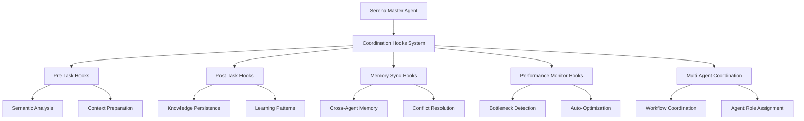

# Serena Master Agent Coordination Hooks System

## Overview

The Serena Master Agent Coordination Hooks System is a comprehensive framework that provides semantic-aware coordination capabilities for multi-agent workflows within the Archon ecosystem. It integrates seamlessly with Claude Flow orchestration and the existing Archon architecture to enable intelligent, efficient, and robust agent coordination.

## Architecture

### Core Components



### Integration Points

- **Claude Flow System**: Native integration for swarm coordination
- **Archon PRP Framework**: Progressive refinement support
- **MCP Protocol**: Standardized agent communication
- **Semantic Intelligence**: LSP-powered code analysis

## Core Capabilities

### 1. Pre-Task Semantic Preparation

Prepares comprehensive semantic context before task execution:

- **Project Structure Analysis**: Deep understanding of codebase architecture
- **Symbol Resolution**: Complete symbol mapping and relationships
- **Pattern Detection**: Identification of architectural patterns
- **Context Caching**: Efficient semantic context management
- **Coordination State Setup**: Multi-agent coordination initialization

#### Usage Example

```python
from python.src.server.utils.serena_coordination_client import create_coordination_client

async with create_coordination_client() as client:
    # Prepare task with semantic analysis
    result = await client.prepare_task(
        task_id="refactor_authentication_system",
        project_path="/path/to/project",
        target_files=["auth/", "models/user.py"],
        coordination_level="group",
        task_type="refactoring"
    )
    
    if result.success:
        semantic_context = result.data["semantic_context"]
        print(f"Analyzed {semantic_context['file_count']} files")
        print(f"Found {semantic_context['symbol_count']} symbols")
```

### 2. Post-Task Knowledge Persistence

Captures and persists knowledge gained from task execution:

- **Pattern Learning**: Successful patterns and strategies
- **Knowledge Artifacts**: Code improvements and insights
- **Cross-Agent Sharing**: Distribution to agent network
- **Performance Models**: Continuous improvement data
- **Quality Metrics**: Success rate tracking

#### Usage Example

```python
# Complete task and persist knowledge
task_result = {
    "task_id": "refactor_authentication_system",
    "success": True,
    "patterns_used": ["Extract Method", "Strategy Pattern"],
    "code_improvements": [
        "Reduced complexity by 35%",
        "Improved test coverage to 95%"
    ],
    "quality_indicators": {
        "maintainability": 8.5,
        "performance": 9.2
    }
}

execution_metrics = {
    "execution_time": 245.6,
    "memory_usage": 67.3,
    "cache_hit_rate": 0.87
}

completion_result = await client.complete_task(
    task_result=task_result,
    execution_metrics=execution_metrics
)
```

### 3. Multi-Agent Workflow Coordination

Orchestrates complex multi-agent workflows with semantic intelligence:

- **Role Assignment**: Optimal agent-task matching
- **Context Sharing**: Shared semantic understanding
- **Communication Protocols**: Efficient agent coordination
- **Quality Gates**: Automated validation checkpoints
- **Conflict Resolution**: Intelligent dispute handling

#### Usage Example

```python
# Coordinate multi-agent workflow
workflow_result = await client.coordinate_workflow(
    workflow_name="full_stack_feature_development",
    workflow_description="Implement user dashboard with real-time updates",
    participating_agents=[
        "serena-master",      # Semantic analysis and coordination
        "system-architect",   # Architecture planning
        "backend-dev",        # API development
        "frontend-dev",       # UI implementation
        "tester",            # Quality assurance
        "reviewer"           # Code review
    ],
    workflow_phases=[
        {
            "name": "analysis_and_planning",
            "duration": 1800,  # 30 minutes
            "agents": ["serena-master", "system-architect"]
        },
        {
            "name": "parallel_development",
            "duration": 7200,  # 2 hours
            "agents": ["backend-dev", "frontend-dev"]
        },
        {
            "name": "integration_and_testing",
            "duration": 3600,  # 1 hour
            "agents": ["tester", "serena-master"]
        },
        {
            "name": "review_and_finalization",
            "duration": 1800,  # 30 minutes
            "agents": ["reviewer", "serena-master"]
        }
    ],
    coordination_level="swarm"
)
```

### 4. Memory Synchronization

Maintains coherent state across distributed agents:

- **Cross-Agent Memory**: Shared context and knowledge
- **Conflict Detection**: Automatic inconsistency identification
- **State Reconciliation**: Intelligent conflict resolution
- **Cache Coherence**: Distributed caching strategies
- **Persistence Management**: Long-term state storage

#### Usage Example

```python
# Synchronize memory across agents
sync_result = await client.synchronize_memory(
    scope="distributed",
    target_types=["coordination_state", "semantic_context", "shared_knowledge"],
    force_sync=False
)

if sync_result.success:
    sync_data = sync_result.data
    print(f"Synchronized {sync_data['targets_synchronized']} targets")
    print(f"Memory coherence: {sync_data['synchronization_metrics']['memory_coherence_score']:.2%}")
```

### 5. Performance Monitoring and Optimization

Continuous performance monitoring with automatic optimization:

- **Real-Time Metrics**: System and coordination performance
- **Bottleneck Detection**: Automatic issue identification
- **Predictive Modeling**: Performance trend analysis
- **Auto-Optimization**: Intelligent system tuning
- **Resource Management**: Efficient resource allocation

#### Usage Example

```python
# Monitor performance and apply optimizations
monitoring_result = await client.monitor_performance(
    scope="comprehensive",
    components=["system", "coordination", "semantic_analysis", "memory"],
    auto_optimize=True
)

if monitoring_result.success:
    health_data = monitoring_result.data["health_analysis"]
    print(f"System health: {health_data['overall_score']:.1f}/100")
    
    if health_data["concerns"]:
        print("Performance concerns:")
        for concern in health_data["concerns"]:
            print(f"  - {concern}")
    
    optimizations = monitoring_result.data["auto_optimization_results"]
    if optimizations["applied"]:
        print(f"Applied {len(optimizations['applied'])} automatic optimizations")
```

## API Reference

### REST API Endpoints

#### Pre-Task Hooks
- `POST /serena/coordination/hooks/pre-task/semantic-preparation`
- `GET /serena/coordination/hooks/pre-task/semantic-context/{task_id}`

#### Post-Task Hooks
- `POST /serena/coordination/hooks/post-task/knowledge-persistence`
- `GET /serena/coordination/hooks/post-task/learning-patterns`

#### Multi-Agent Coordination
- `POST /serena/coordination/hooks/multi-agent/workflow-coordination`
- `GET /serena/coordination/hooks/multi-agent/coordination-state/{task_id}`
- `POST /serena/coordination/hooks/multi-agent/register-pattern`

#### Memory Synchronization
- `POST /serena/coordination/hooks/memory/synchronization`
- `GET /serena/coordination/hooks/memory/sync-status`

#### Performance Monitoring
- `POST /serena/coordination/hooks/performance/monitoring`
- `GET /serena/coordination/hooks/performance/metrics`
- `GET /serena/coordination/hooks/performance/health`

#### System Management
- `GET /serena/coordination/hooks/status`
- `POST /serena/coordination/hooks/export`
- `DELETE /serena/coordination/hooks/cleanup/{task_id}`
- `POST /serena/coordination/hooks/optimize`

### Python SDK

#### Client Initialization
```python
from python.src.server.utils.serena_coordination_client import SerenaCoordinationClient

# Create client with custom configuration
client = SerenaCoordinationClient(
    base_url="http://localhost:8080",
    api_key="your-api-key",
    timeout=60,
    retry_attempts=3
)

# Use as async context manager
async with client:
    # Your coordination code here
    pass
```

#### Decorator Pattern
```python
from python.src.server.utils.serena_coordination_client import coordination_decorator

@coordination_decorator(
    task_type="semantic_analysis",
    coordination_level="individual",
    project_path="/path/to/project"
)
async def analyze_codebase(files):
    # Your analysis code here
    return analysis_results
```

#### High-Level Workflow Execution
```python
# Execute complete coordinated task
result = await client.execute_coordinated_task(
    task_id="my_task_001",
    task_function=my_async_task_function,
    project_path="/project/path",
    coordination_level="group"
)
```

## Configuration

### Environment Variables

```bash
# Coordination system configuration
SERENA_COORDINATION_BASE_URL=http://localhost:8080
SERENA_COORDINATION_API_KEY=your-api-key-here
SERENA_COORDINATION_TIMEOUT=30
SERENA_COORDINATION_RETRY_ATTEMPTS=3

# Hook execution configuration
SERENA_HOOK_TIMEOUT=60
SERENA_MAX_RETRY_ATTEMPTS=3
SERENA_MEMORY_SYNC_INTERVAL=300
SERENA_PERFORMANCE_CHECK_INTERVAL=60

# Storage paths
SERENA_HOOKS_PATH=.serena/hooks
SERENA_MEMORY_PATH=.serena/memory
SERENA_METRICS_PATH=.serena/metrics
```

### System Configuration

```python
# Custom configuration for coordination hooks
coordination_config = {
    "max_retry_attempts": 5,
    "hook_timeout": 45.0,
    "memory_sync_interval": 600,  # 10 minutes
    "performance_check_interval": 120,  # 2 minutes
    "enable_auto_optimization": True,
    "cache_strategy": "aggressive",
    "coordination_levels": {
        "individual": {"max_agents": 1},
        "pairwise": {"max_agents": 2},
        "group": {"max_agents": 8},
        "swarm": {"max_agents": 20},
        "ecosystem": {"max_agents": 100}
    }
}
```

## Integration Patterns

### 1. Claude Flow Integration

```python
# Initialize Claude Flow swarm with Serena coordination
async def setup_coordinated_swarm():
    # Initialize swarm
    swarm_result = await claude_flow_service.initialize_swarm(
        topology="adaptive",
        max_agents=10,
        archon_integration=True
    )
    
    # Setup Serena coordination
    if swarm_result["status"] == "initialized":
        coord_result = await serena_coordination_hooks.coordinate_multi_agent_workflow(
            workflow_definition={
                "workflow_id": swarm_result["session_id"],
                "name": "Claude Flow Coordinated Swarm",
                "coordination_level": "swarm"
            },
            participating_agents=["serena-master", "coder", "reviewer", "tester"]
        )
        
    return coord_result
```

### 2. Archon Task Integration

```python
# Integrate with Archon task management
async def execute_archon_task_with_coordination(task_id: str):
    # Get task from Archon
    task = await archon_task_service.get_task(task_id)
    
    # Prepare with Serena coordination
    prep_result = await serena_coordination_hooks.pre_task_semantic_preparation(
        task_context={
            "task_id": task_id,
            "project_path": task.project_path,
            "task_type": task.task_type,
            "archon_task_data": task.dict()
        }
    )
    
    # Execute task with coordination
    if prep_result.success:
        # Task execution logic here
        task_result = await execute_task_logic(task, prep_result.data)
        
        # Complete with knowledge persistence
        completion_result = await serena_coordination_hooks.post_task_knowledge_persistence(
            task_result=task_result,
            execution_metrics={"execution_time": task_result.get("duration", 0)}
        )
        
    return completion_result
```

### 3. MCP Protocol Integration

```python
# MCP server integration
class SerenaCoordinationMCPServer:
    def __init__(self):
        self.coordination_client = SerenaCoordinationClient()
    
    async def handle_mcp_request(self, request):
        if request.method == "serena/coordinate":
            # Handle coordination request via MCP
            return await self.coordination_client.coordinate_workflow(
                workflow_name=request.params["workflow_name"],
                participating_agents=request.params["agents"]
            )
        elif request.method == "serena/semantic_analysis":
            # Handle semantic analysis request
            return await self.coordination_client.prepare_task(
                task_id=request.params["task_id"],
                project_path=request.params["project_path"]
            )
```

## Performance Characteristics

### Latency Targets
- **Hook Execution**: < 100ms for simple hooks, < 500ms for complex
- **Semantic Analysis**: < 200ms per file (up to 10K lines)
- **Memory Synchronization**: < 50ms for local sync, < 200ms distributed
- **Coordination Setup**: < 1s for small groups, < 5s for large swarms

### Throughput Capabilities
- **Concurrent Tasks**: 50+ parallel coordinated tasks
- **Agent Coordination**: 100+ agents in ecosystem-level coordination
- **Memory Operations**: 1000+ operations per second
- **Performance Monitoring**: Real-time metrics at 1Hz frequency

### Scalability Limits
- **Semantic Contexts**: 10,000+ active contexts
- **Coordination States**: 5,000+ active states
- **Memory Storage**: 100GB+ persistent coordination data
- **Learning Patterns**: 1M+ stored learning patterns

## Error Handling and Recovery

### Retry Logic
- **Exponential Backoff**: 2^attempt seconds (max 30s)
- **Transient Error Detection**: Automatic retry for network/timeout errors
- **Circuit Breaker**: Temporary disable after consecutive failures
- **Fallback Mechanisms**: Graceful degradation when services unavailable

### Error Categories
```python
# Transient errors (retry)
TRANSIENT_ERRORS = [
    "ConnectionError",
    "TimeoutError", 
    "ServiceUnavailable",
    "TemporaryFailure"
]

# Permanent errors (no retry)
PERMANENT_ERRORS = [
    "AuthenticationError",
    "AuthorizationError",
    "ValidationError",
    "ConfigurationError"
]
```

### Recovery Strategies
1. **Local Recovery**: Use cached data when possible
2. **Graceful Degradation**: Reduce functionality rather than fail
3. **State Reconstruction**: Rebuild from persistent storage
4. **Manual Intervention**: Escalate to administrators when needed

## Monitoring and Observability

### Metrics Collection
```python
# Key performance metrics
PERFORMANCE_METRICS = {
    "hook_execution_time": "Histogram",
    "memory_sync_frequency": "Counter", 
    "coordination_success_rate": "Gauge",
    "semantic_analysis_accuracy": "Gauge",
    "cache_hit_rate": "Gauge",
    "error_rate": "Counter",
    "active_coordination_states": "Gauge",
    "learning_pattern_count": "Counter"
}
```

### Health Checks
- **System Health**: CPU, memory, disk usage
- **Coordination Health**: Active states, error rates
- **Semantic Health**: Analysis accuracy, cache performance
- **Integration Health**: Claude Flow, Archon connectivity

### Alerting Rules
```yaml
alerting_rules:
  - name: coordination_health
    rules:
      - alert: HighErrorRate
        expr: error_rate > 0.1
        for: 5m
        
      - alert: LowCacheHitRate
        expr: cache_hit_rate < 0.7
        for: 10m
        
      - alert: HighMemoryUsage
        expr: memory_usage_percent > 85
        for: 2m
```

## Best Practices

### 1. Task Coordination
- Always prepare tasks before execution
- Use appropriate coordination levels
- Clean up resources after completion
- Monitor task performance metrics

### 2. Multi-Agent Workflows
- Define clear role assignments
- Set realistic duration estimates
- Implement proper error handling
- Use quality gates for validation

### 3. Memory Management
- Sync memory regularly but not excessively
- Resolve conflicts promptly
- Archive old data to prevent bloat
- Monitor memory coherence

### 4. Performance Optimization
- Enable automatic optimizations
- Monitor bottlenecks continuously
- Scale coordination levels appropriately
- Use caching strategies effectively

### 5. Error Handling
- Implement comprehensive retry logic
- Use circuit breakers for external services
- Provide fallback mechanisms
- Log errors with sufficient context

## Troubleshooting

### Common Issues

#### 1. Coordination Setup Failures
**Symptoms**: Workflow coordination fails during setup
**Causes**: 
- Invalid agent configurations
- Network connectivity issues
- Resource constraints

**Solutions**:
```python
# Check system status
status = await client.get_system_status()
print(f"System health: {status.data}")

# Verify agent availability
agents_result = await client.get_coordination_state(task_id)
if not agents_result.success:
    print(f"Agent coordination issue: {agents_result.error}")
```

#### 2. Memory Synchronization Problems
**Symptoms**: Inconsistent state across agents
**Causes**:
- Network partitions
- Conflicting updates
- Stale cache data

**Solutions**:
```python
# Force memory synchronization
sync_result = await client.synchronize_memory(
    scope="distributed",
    force_sync=True
)

# Check for conflicts
memory_status = await client.get_memory_status()
if memory_status.data["conflicts"]:
    print("Memory conflicts detected - manual resolution needed")
```

#### 3. Performance Degradation
**Symptoms**: Slow hook execution, high latency
**Causes**:
- Resource bottlenecks
- Cache misses
- Inefficient algorithms

**Solutions**:
```python
# Trigger optimization
optimization_result = await client.optimize_system(scope="comprehensive")

# Monitor performance metrics
metrics = await client.get_system_metrics()
bottlenecks = metrics.data["bottleneck_analysis"]
print(f"Detected bottlenecks: {bottlenecks}")
```

### Debug Mode
```python
# Enable detailed logging
import logging
logging.getLogger("serena.coordination").setLevel(logging.DEBUG)

# Export coordination data for analysis
export_result = await client.export_coordination_data(
    export_path="/tmp/coordination_debug.json",
    include_sensitive=False
)
```

## Future Enhancements

### Planned Features
1. **Machine Learning Integration**: Predictive coordination patterns
2. **Blockchain Coordination**: Decentralized agent consensus
3. **Visual Workflow Designer**: GUI for coordination patterns
4. **Advanced Analytics**: Deep performance insights
5. **Federation Support**: Cross-organization coordination

### Research Directions
1. **Quantum-Inspired Coordination**: Quantum computing principles
2. **Neuromorphic Processing**: Brain-inspired coordination
3. **Swarm Intelligence**: Biological swarm behaviors
4. **Autonomous Evolution**: Self-improving coordination patterns

## Contributing

### Development Setup
```bash
# Clone repository
git clone https://github.com/your-org/archon-fork.git
cd archon-fork

# Install dependencies
pip install -r requirements.txt
pip install -r requirements-dev.txt

# Run tests
python -m pytest tests/services/test_serena_coordination_hooks.py -v

# Start development server
python -m python.src.server.main
```

### Code Standards
- Follow PEP 8 style guidelines
- Add comprehensive docstrings
- Include type hints
- Write unit and integration tests
- Update documentation

### Pull Request Process
1. Create feature branch from main
2. Implement changes with tests
3. Update documentation
4. Run full test suite
5. Submit PR with detailed description

## Support and Resources

### Documentation
- [API Reference](./api-reference.md)
- [Integration Examples](./examples/)
- [Performance Tuning Guide](./performance-guide.md)
- [Troubleshooting FAQ](./troubleshooting-faq.md)

### Community
- [GitHub Issues](https://github.com/your-org/archon-fork/issues)
- [Discord Server](https://discord.gg/archon)
- [Developer Forum](https://forum.archon.dev)

### Professional Support
- Enterprise support available
- Custom integration consulting  
- Training and workshops
- 24/7 monitoring services

---

The Serena Master Agent Coordination Hooks System represents a significant advancement in multi-agent coordination capabilities, providing semantic intelligence, robust error handling, and comprehensive performance monitoring. This system enables sophisticated agent collaboration while maintaining simplicity and reliability for developers.

For the latest updates and detailed examples, visit our [GitHub repository](https://github.com/your-org/archon-fork) and [documentation site](https://docs.archon.dev).